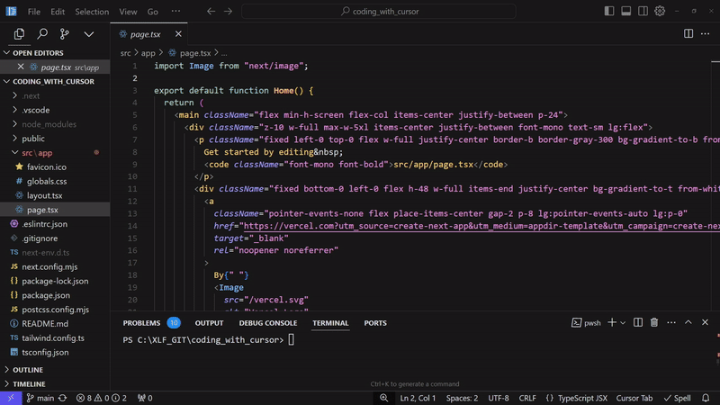

# Coding with cursor

This project is a simple app generated using Cursor AI and allows the user to check any stock market and display a graph timeline with the value the last 20 years.



This is a simple [Next.js](https://nextjs.org/) project bootstrapped with [`create-next-app`](https://github.com/vercel/next.js/tree/canary/packages/create-next-app), it's used as a starting point for testing a prompt in Cursor AI.

More information can be found in the blog post [Code Smarter, Not Harder: Developing with Cursor and Claude Sonnet](https://jstoppa.com/posts/artificial-intelligence/fundamentals/code-smarter-not-harder-developing-with-cursor-and-claude-sonnet/post/).

The prompt below is used to generate an app that allows the user to check any stock market and display a graph timeline with the value the last 20 years.

```
create an app what allows you to search any stock in the market and show them in a graph timeline with the value in the last 20 years. 

make sure 
- add any new library to package.json so I can easily install them
- any new file should be inside the folder /src/app
- modify /src/app files so the page loads the stock page directly
- use the free yahoo finance API and make the API call from the server side to avoid CORS issues
- the page should work if it's opened in a system where the default setting is dark mode
```

